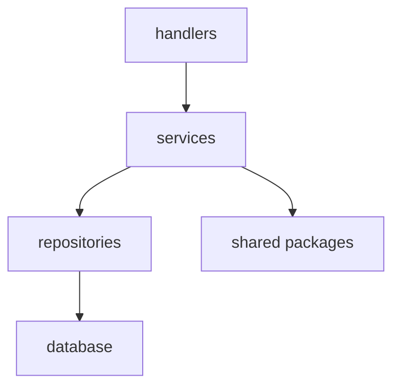

# /rs-arch — Architecture Review

**Iron Law: ARCHITECTURE IS SHARED UNDERSTANDING. A violation that surprises the next developer is a bug.**

**argument-hint:** `[scope — module path, or 'all' for full codebase]` (default: recent changes)

---

## Phase 1: Load Context

1. Read `CLAUDE.md` (project root) for project conventions, terminology, and architectural rules.
2. Check for `.codegraph/` directory — if present, use codegraph tools in Phase 4.
3. Note any Operating Mode definitions (`docs/ai/operating-modes.md`) for compliance checking.

## Phase 2: Scope

- **If argument given:** scope analysis to that module path (e.g., `apps/api-go/internal/handlers/`).
- **If `all`:** scan the full codebase.
- **If no argument:** use `git diff main --stat` to identify recently changed files and scope to those.

## Phase 3: Structural Analysis

Check for each of the following violations:

### Layer Violations
- **Expected flow:** handler -> service -> repo (or equivalent layered architecture).
- **Violation:** handlers calling repo directly, skipping the service layer.
- **Violation:** inner layers importing outer layers (e.g., a service importing a handler).

### Dependency Direction
- No circular imports between packages.
- Inner layers (domain, service) must not depend on outer layers (handlers, middleware, CLI).
- Shared packages (`packages/`) should not import from `apps/`.

### God Files
- Functions exceeding **50 statements** — too long to test or understand.
- Functions exceeding **25 cognitive complexity** — high bug risk.
- Nesting depth exceeding **3 levels** — hard to follow.
- Flag these with the exact function name and file location.

### Package Main Bloat
- `cmd/` and `main.go` should be thin entry points (wire dependencies, call `Run()`).
- Business logic in `cmd/` is a violation — it belongs in `internal/` or a package.

### Operating Mode Compliance
- Check if modified files fall under OM3+ components (see `docs/ai/operating-modes.md`).
- OM3 components: GitLab API integration, login/CLI token auth.
- OM4/OM5 components must not be modified without explicit human approval.

### Client-First Architecture
- ox CLI should be the primary producer of AI-derived artifacts.
- Backend workflow should be the anti-entropy fallback, not the primary path.
- Extraction logic (prompts, parsing, builders) belongs in shared packages (`packages/*-go/`), not locked inside `apps/workflow/internal/`.

### Shared Package Extraction Opportunities
- Scan `apps/` for duplicated logic across multiple apps.
- If the same struct, function, or pattern appears in 2+ apps, flag it as a candidate for extraction to `packages/`.

## Phase 4: CodeGraph Analysis

**Skip this phase if `.codegraph/` does not exist.**

If `.codegraph/` exists, use codegraph MCP tools for deeper analysis:

1. **`codegraph_search`** — Find symbols in the scoped area.
2. **`codegraph_callers`** / **`codegraph_callees`** — Map the dependency graph for key functions.
3. **`codegraph_impact`** — Identify the impact radius of recent changes.
4. **High fan-out detection** — Functions with too many callees are likely God functions. Flag any function calling 10+ distinct functions.
5. **Orphan detection** — Exported symbols with zero callers outside their own package may be dead code.

## Phase 5: Report

### Dependency Diagram

If the scoped area has non-trivial dependencies, include a Mermaid diagram:

### Violations Table

| File | Violation | Severity | Suggested Fix |
|------|-----------|----------|---------------|
| `path/to/file.go` | Handler calls repo directly | HIGH | Extract to service layer |
| `path/to/big.go:FuncName` | 67 statements (limit: 50) | MEDIUM | Extract helper functions |

Severity levels:
- **CRITICAL** — Breaks architectural boundaries, causes runtime issues, or violates OM4/OM5 restrictions.
- **HIGH** — Layer violation, circular dependency, or God function.
- **MEDIUM** — Exceeds complexity thresholds, package main bloat, missing shared extraction.
- **LOW** — Style preference, minor structural improvement opportunity.

### Status

End the report with one of:

- **STATUS: CLEAN** — No violations found.
- **STATUS: VIOLATIONS_FOUND** — Non-critical violations detected (table above).
- **STATUS: CRITICAL_VIOLATIONS** — Critical violations that should block merge.
